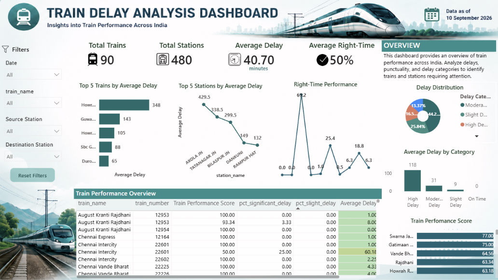

# Indian Train Delay Analysis 🚆

## 📌 Project Overview

This project analyzes Indian train delay and punctuality data to identify delay patterns, train performance, and station-level insights.

The project follows an end-to-end Data Analytics workflow using Excel, Python, SQL, and Power BI.

## 🛠️ Tools & Technologies

- Excel – Data cleaning and preprocessing
- Python – Exploratory Data Analysis (EDA)
- SQL – Business analysis and data querying
- Power BI – Interactive dashboard and visualization
- Jupyter Notebook – Python and SQL analysis

## 📊 Key Analysis

- Overall average train delay
- Train-wise delay performance
- Station-wise delay performance
- Right-time performance
- Significant and slight delay analysis
- Delay category distribution
- Train performance scoring
- Top delayed trains and stations

## 📈 Power BI Dashboard

### Key KPIs

- Total Trains: 90
- Total Stations: 480
- Average Delay: 40.70 minutes
- Average Right-Time: 50.41%

## 📂 Project Files

- `Indian_Train_Delay_Cleaned.xlsx` – Cleaned dataset
- `Indian_Train_Delay_EDA.ipynb` – Python EDA
- `Indian_Train_Delay_SQL_Analysis.ipynb` – SQL analysis
- `Indian_Train_Delay_Analysis_Dashboard.pbix` – Power BI dashboard

## 🔍 Dataset Note

The dataset contains train and station-level delay information collected on a specific date. Therefore, the project focuses on train-wise and station-wise performance rather than historical monthly or seasonal trends.

## 👩‍💻 Author

**Princy Dubey**

B.Tech – Data Science
